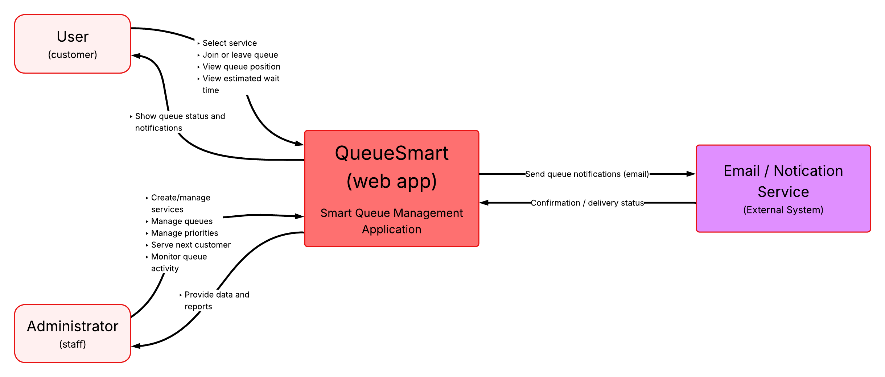
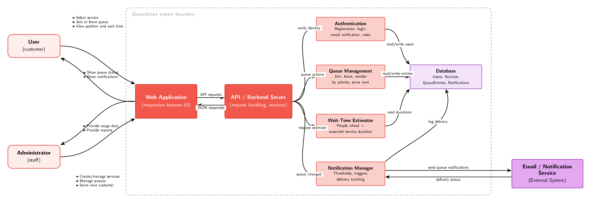

# QueueSmart

## Assignment 1 – Initial Thoughts and System Design

### Team Members

- Celestin Matala
- Celeste
- Megan
- Valeriia

---

## 1. Initial Thoughts
<!-- Owner: Celeste -->

### Main Users

### User Interaction

### Important Features

### Challenges

---

## 2. Development Methodology
<!-- Owner: Megan -->

### Agile / Scrum

### Why It Fits QueueSmart

### Team Workflow

---

## 3. High-Level Architecture

### System Context Diagram
<!-- Owner: Valeriia -->

### Architecture Explanation
The System Context Diagram describes QueueSmart as a whole system and depicts the interaction between the key users/administrator and the external systems with QueueSmart.

User (Customer): The user interacts with QueueSmart in order to choose the service, join/leave the queue, see their current position in the queue, and their estimated waiting time. In addition to that, QueueSmart provides queue status and notifications to the user.

Administrator (Staff): The administrator interacts with QueueSmart in order to create/manage services, manage queues and priorities, serve the next customer, and monitor the queue activities. QueueSmart may also provide basic queue activity reports to the administrator.

Email / Notification Service: QueueSmart interacts with the external Email/Notification Service in order to send email notifications to the users. Such notifications can be related to the fact that it is time to see the customer.

In general, QueueSmart is the central system connecting the users, the administrator, and the external notification system. This diagram highlights the main interactions without going into implementation details, such as programming languages, frameworks, and APIs.
<!-- Owner: Celestin -->

### Container Diagram
<!-- Owner: Celestin -->

---

## 4. Team Contributions

See [CONTRIBUTIONS.md](../CONTRIBUTIONS.md).
